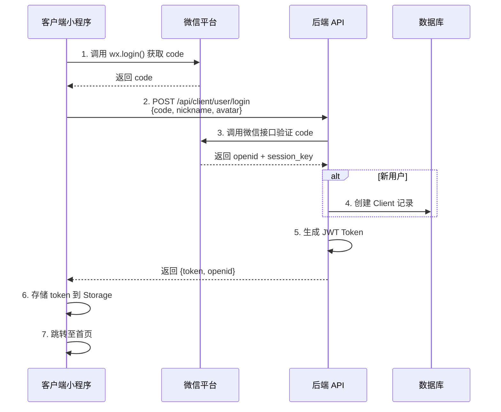
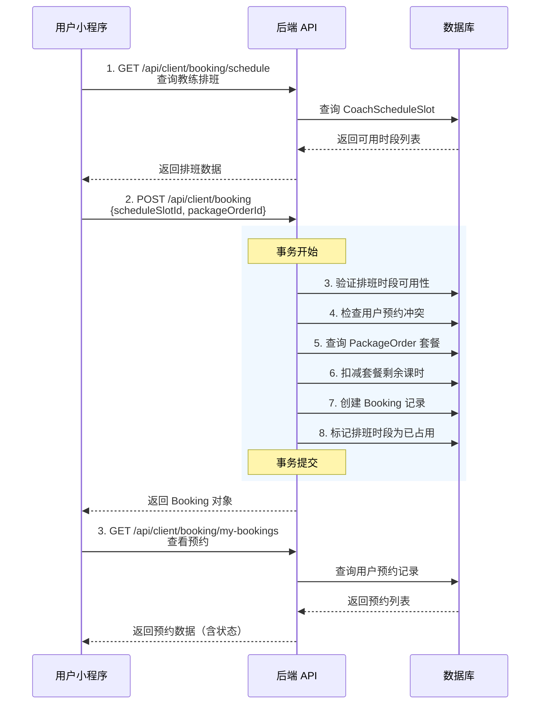
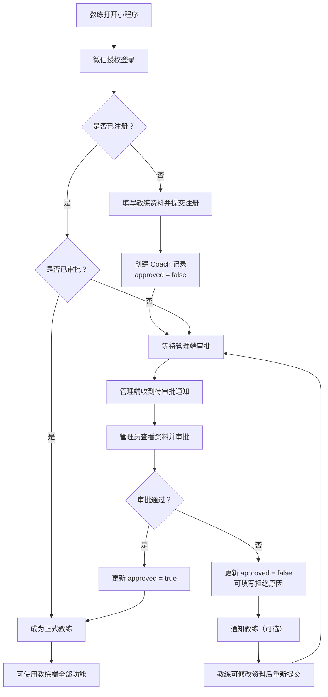
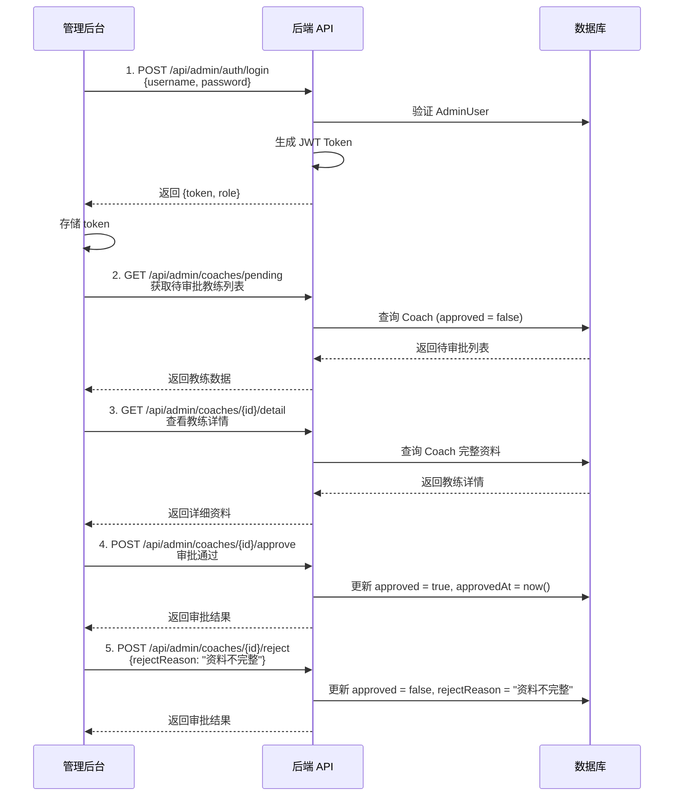
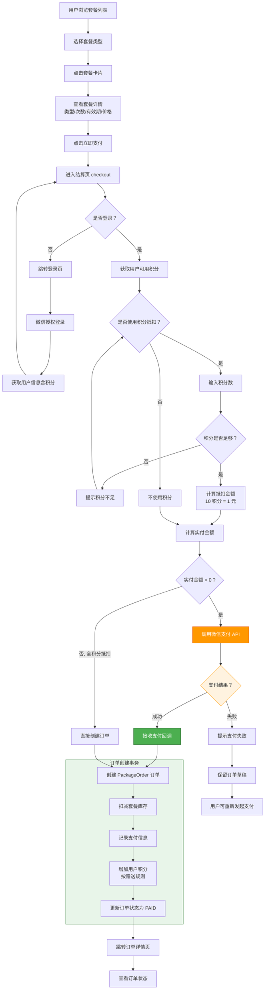
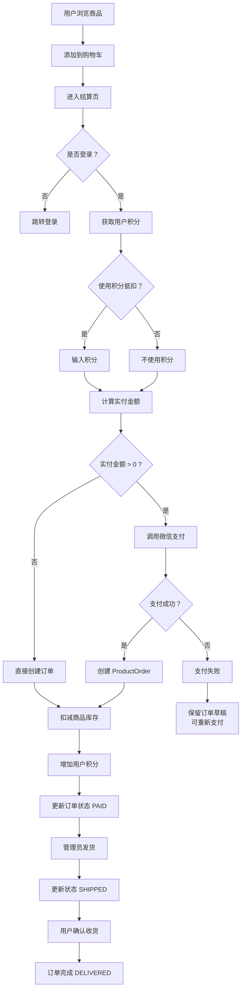
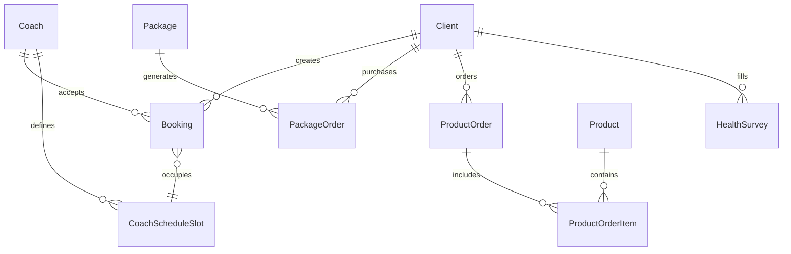

# 项目全局架构与开发规范白皮书

> 文档版本：v1.0  
> 生成日期：2026-04-01  
> 适用对象：开发团队、产品经理、测试人员

---

## 1. 项目全局概览 (Project Overview)

### 1.1 项目描述

**SAF 健身管理系统** 是一套完整的健身房业务管理平台，包含三个终端：

- **管理后台 Web 端**：供健身房管理员使用，负责用户管理、教练管理、商品管理、订单管理、预约管理等核心运营功能
- **客户端小程序**：供健身会员使用，支持浏览教练、预约课程、购买套餐和商品、查看订单等功能
- **教练端小程序**：供教练使用，支持查看课程安排、学员管理、体测录入、预约核销等功能

系统实现了健身房业务的完整闭环：用户购买套餐 → 预约课程 → 到店核销 → 教练授课 → 订单完成。

### 1.2 技术栈

| 模块 | 技术栈 | 版本/说明 |
|------|--------|-----------|
| **管理后台前端** | React 18 + Vite + TypeScript | 使用 shadcn/ui 组件库、React Router v7、Recharts 图表 |
| **小程序端** | Taro 4.x + React 18 + TypeScript | 跨端框架，支持微信小程序等多端发布 |
| **后端** | Spring Boot 4.0.4 + Java 17 | Spring MVC + Spring Security + Spring Data JPA |
| **数据库** | MySQL | 主数据库 |
| **缓存** | Caffeine | 本地缓存 |
| **认证** | JWT | Token 有效期 24 小时 |
| **小程序 SDK** | 微信 Java SDK (binarywang) | 微信小程序登录与支付 |
| **API 文档** | SpringDoc OpenAPI 3 | Swagger UI |

---

## 2. 全局目录结构图 (Directory Structure)

```
fitness-admin-all/
├── fitness-admin-web/          # 管理后台 Web 端
│   ├── src/
│   │   ├── app/
│   │   │   ├── components/
│   │   │   │   ├── pages/      # 页面组件
│   │   │   │   │   ├── Dashboard.tsx       # 首页概览
│   │   │   │   │   ├── Login.tsx           # 登录页
│   │   │   │   │   ├── UserList.tsx        # 用户管理
│   │   │   │   │   ├── CoachList.tsx       # 教练管理
│   │   │   │   │   ├── PackageList.tsx     # 套餐管理
│   │   │   │   │   ├── ProductList.tsx     # 商品管理
│   │   │   │   │   ├── PackageOrders.tsx    # 套餐订单
│   │   │   │   │   ├── ProductOrders.tsx   # 商品订单
│   │   │   │   │   ├── Bookings.tsx        # 预约管理
│   │   │   │   │   ├── CheckinRecords.tsx  # 核销记录
│   │   │   │   │   ├── Banners.tsx         # 轮播图管理
│   │   │   │   │   └── Statistics.tsx      # 统计数据
│   │   │   │   ├── ui/         # shadcn/ui 基础组件（约 40+ 个）
│   │   │   │   ├── figma/      # Figma 导入组件
│   │   │   │   └── Pagination.tsx, Modal.tsx
│   │   │   ├── lib/
│   │   │   │   ├── api.ts      # API 请求封装（含完整接口定义）
│   │   │   │   ├── auth.tsx    # 认证 Context
│   │   │   │   └── ProtectedRoute.tsx  # 路由守卫
│   │   │   ├── app.tsx         # 应用入口
│   │   │   └── routes.tsx      # 路由配置
│   │   ├── main.tsx
│   │   └── vite.config.ts
│   ├── dist/                   # 构建输出
│   └── package.json
│
├── fitness-taro/               # 小程序端（客户端 + 教练端）
│   ├── src/
│   │   ├── pages/
│   │   │   ├── client/         # 客户端页面
│   │   │   │   ├── index/              # 首页（轮播图、推荐教练）
│   │   │   │   ├── booking/            # 预约页（教练列表）
│   │   │   │   ├── shop/               # 商城页
│   │   │   │   ├── profile/            # 个人中心
│   │   │   │   ├── packages/           # 套餐列表
│   │   │   │   ├── my-bookings/        # 我的预约
│   │   │   │   ├── my-orders/          # 我的订单
│   │   │   │   ├── product-orders/     # 商品订单
│   │   │   │   ├── checkout/           # 结算页
│   │   │   │   ├── health-survey/      # 健康问卷
│   │   │   │   ├── brand-story/        # 品牌理念
│   │   │   │   ├── coach-detail/       # 教练详情
│   │   │   │   └── booking-schedule/   # 预约排班
│   │   │   └── coach/          # 教练端页面
│   │   │       ├── index/              # 教练工作台
│   │   │       ├── members/            # 学员管理
│   │   │       ├── schedule/           # 课表查看
│   │   │       ├── performance/        # 业绩统计
│   │   │       ├── notifications/      # 消息通知
│   │   │       ├── today-courses/      # 今日课程
│   │   │       ├── proxy-booking/      # 代客预约
│   │   │       ├── scan/               # 扫码核销
│   │   │       ├── body-assessment/    # 体测录入
│   │   │       ├── member-detail/      # 学员详情
│   │   │       └── class-detail/       # 课程详情
│   │   ├── components/
│   │   │   ├── CoachBottomNav/ # 教练端底部导航
│   │   │   └── BackToHome/     # 返回首页组件
│   │   ├── utils/
│   │   │   ├── request.ts      # Taro 请求封装
│   │   │   └── types.ts        # 类型定义
│   │   ├── data/
│   │   │   └── mock.ts         # Mock 数据
│   │   ├── pages/coach/shared/mock.ts
│   │   ├── app.ts              # 小程序入口
│   │   └── app.config.ts       # 小程序配置（TabBar 等）
│   ├── config/
│   │   ├── index.ts            # 通用配置
│   │   ├── dev.ts              # 开发环境配置
│   │   └── prod.ts             # 生产环境配置
│   └── package.json
│
├── fitness-java/               # 后端服务
│   ├── src/main/java/org/example/fitnessjava/
│   │   ├── FitnessJavaApplication.java     # Spring Boot 启动类
│   │   ├── config/
│   │   │   ├── SecurityConfig.java         # 安全配置（CORS、JWT 过滤器）
│   │   │   └── WxAConfig.java              # 微信小程序配置
│   │   ├── controller/
│   │   │   ├── admin/          # 管理后台接口
│   │   │   │   ├── AdminAuthController.java    # 认证（登录/登出）
│   │   │   │   ├── AdminCoachController.java   # 教练管理
│   │   │   │   ├── AdminPackageOrderController.java  # 套餐订单管理
│   │   │   │   ├── AdminPackageController.java    # 套餐管理
│   │   │   │   ├── AdminProductController.java    # 商品管理
│   │   │   │   ├── AdminProductOrderController.java # 商品订单管理
│   │   │   │   └── AdminUserController.java       # 用户管理
│   │   │   ├── client/         # 客户端接口
│   │   │   │   ├── BookingController.java    # 预约接口
│   │   │   │   ├── HomeController.java       # 首页数据
│   │   │   │   ├── PackageProductController.java # 套餐查询
│   │   │   │   ├── ProductController.java    # 商品查询
│   │   │   │   ├── SurveyController.java     # 健康问卷
│   │   │   │   └── UserController.java       # 用户登录/信息
│   │   │   ├── CoachController.java          # 教练查询（通用）
│   │   │   ├── PackageOrderController.java    # 套餐订单（通用）
│   │   │   └── UserController.java           # 用户登录（通用）
│   │   ├── service/
│   │   │   ├── impl/             # Service 实现类
│   │   │   │   ├── BookingServiceImpl.java     # 预约服务（核心业务逻辑）
│   │   │   │   ├── CoachServiceImpl.java
│   │   │   │   ├── ClientServiceImpl.java
│   │   │   │   ├── PackageOrderServiceImpl.java
│   │   │   │   ├── PackageProductServiceImpl.java
│   │   │   │   ├── ProductOrderServiceImpl.java
│   │   │   │   └── ProductServiceImpl.java
│   │   │   └── *.java           # Service 接口
│   │   ├── dao/                  # Repository 层
│   │   │   ├── AdminUserRepository.java
│   │   │   ├── BannerRepository.java
│   │   │   ├── BookingRepository.java
│   │   │   ├── ClientRepository.java
│   │   │   ├── CoachRepository.java
│   │   │   ├── CoachScheduleSlotRepository.java
│   │   │   ├── CoachWithUserRepository.java
│   │   │   ├── PackageOrderRepository.java
│   │   │   ├── HealthSurveyRepository.java
│   │   │   ├── PackageProductRepository.java
│   │   │   ├── ProductOrderRepository.java
│   │   │   └── ProductRepository.java
│   │   ├── pojo/                 # 实体类
│   │   │   ├── BaseEntity.java           # 基础实体（createTime, updateTime）
│   │   │   ├── AdminUser.java            # 管理员
│   │   │   ├── AdminRole.java            # 管理员角色枚举
│   │   │   ├── Client.java               # 客户端用户
│   │   │   ├── Coach.java                # 教练
│   │   │   ├── CoachScheduleSlot.java    # 教练排班时段
│   │   │   ├── Booking.java              # 预约记录
│   │   │   ├── BookingStatus.java        # 预约状态枚举
│   │   │   ├── BookingSource.java        # 预约来源枚举
│   │   │   ├── PackageOrder.java          # 套餐订单
│   │   │   ├── PackageOrderStatus.java    # 套餐订单状态枚举
│   │   │   ├── Package.java              # 套餐产品
│   │   │   ├── PackageType.java          # 套餐类型枚举
│   │   │   ├── Product.java              # 商品
│   │   │   ├── ProductOrder.java         # 商品订单
│   │   │   ├── ProductOrderItem.java     # 商品订单项
│   │   │   ├── ProductOrderStatus.java   # 商品订单状态枚举
│   │   │   ├── Banner.java               # 轮播图
│   │   │   ├── HealthSurvey.java         # 健康问卷
│   │   │   ├── SaleStatus.java           # 销售状态枚举
│   │   │   ├── dto/                      # 数据传输对象
│   │   │   │   ├── BookingCreateRequest.java
│   │   │   │   ├── BookingUpdateRequest.java
│   │   │   │   └── WxLoginRequest.java
│   │   │   └── vo/                       # 视图对象
│   │   │       ├── ClientHomeResponse.java
│   │   │       ├── PackageOrderVO.java
│   │   │       ├── ProductOrderVO.java
│   │   │       ├── UserVO.java
│   │   │       ├── LoginRequest.java
│   │   │       └── LoginResponse.java
│   │   ├── filter/
│   │   │   └── JwtAuthenticationFilter.java  # JWT 认证过滤器
│   │   ├── advice/
│   │   │   └── GlobalExceptionHandler.java   # 全局异常处理
│   │   ├── listener/
│   │   │   └── DataInitializer.java          # 数据初始化
│   │   └── util/
│   │       └── JwtUtil.java                  # JWT 工具类
│   ├── src/main/resources/
│   │   ├── application.yaml      # 应用配置（数据库、JWT、微信）
│   │   └── dropDB.sql            # 数据库初始化脚本
│   ├── pom.xml
│   └── README.md
│
└── .vscode/                      # VSCode 配置
```

---

## 3. 核心用户流程图 (Core User Flows)

### 3.1 用户登录注册流程（客户端小程序）



### 3.2 课程预约流程（核心业务）



### 3.3 教练注册审批流程（新增）



**状态说明**：

| 状态 | approved | rejectReason | 小程序端表现 |
|------|----------|--------------|--------------|
| 待审批 | false | null | 显示"审核中"，限制部分功能 |
| 已拒绝 | false | 有值 | 显示拒绝原因，允许修改后重新提交 |
| 已通过 | true | - | 可使用教练端全部功能 |

### 3.4 管理后台教练管理流程



### 3.5 套餐购买与支付流程（含积分抵扣）



**支付关键节点说明**：

| 节点 | 说明 | 异常处理 |
|------|------|----------|
| 登录验证 | 结算页检查 token | 无 token 则跳转登录 |
| 积分校验 | 检查可用积分 ≥ 使用积分 | 提示积分不足，关闭抵扣 |
| 微信支付 | 调用 `wx.requestPayment` | 捕获失败，保留订单草稿 |
| 支付回调 | 微信异步通知后端 | 幂等处理，防止重复入账 |
| 订单创建 | 事务操作，保证一致性 | 失败则回滚，提示用户 |

**积分规则**：

```
抵扣比例：10 积分 = 1 元
最大抵扣：订单金额的 100%（可配置）
最小单位：1 积分（0.1 元）
赠送规则：按套餐 price 字段计算赠送积分
```

### 3.6 商品购买与订单流程



---

## 4. 系统架构与模块划分 (System Architecture)

### 4.1 前端架构（管理后台）

#### 4.1.1 页面结构

| 路由 | 页面组件 | 功能描述 |
|------|----------|----------|
| `/login` | Login | 管理员登录 |
| `/` | Dashboard | 首页概览（数据统计、图表） |
| `/users` | UserList | 用户管理（列表、编辑、角色转换） |
| `/coaches` | CoachList | 教练管理（CRUD、状态管理） |
| `/packages` | PackageList | 套餐管理（类型、价格、上下架） |
| `/products` | ProductList | 商品管理（库存、价格、上下架） |
| `/package-orders` | PackageOrders | 套餐订单管理（退款、课时调整） |
| `/product-orders` | ProductOrders | 商品订单管理（发货、退款） |
| `/bookings` | Bookings | 预约管理（确认、取消） |
| `/checkin-records` | CheckinRecords | 核销记录管理 |
| `/banners` | Banners | 轮播图管理 |
| `/statistics` | Statistics | 统计数据页面 |

#### 4.1.2 状态管理

- **认证状态**：使用 React Context (`AuthContext`) 管理用户登录状态
  - `user`: 当前用户信息（username, nickname, role, avatar）
  - `token`: JWT Token
  - `login()`: 登录方法
  - `logout()`: 登出方法
- **路由守卫**：`ProtectedRoute` 组件保护需要登录的页面
- **数据持久化**：Token 和用户信息存储于 localStorage

#### 4.1.3 UI 组件库

- **shadcn/ui**: 约 40+ 个基础组件（Button、Dialog、Table、Form 等）
- **MUI**: 部分组件（Material Design 风格）
- **Recharts**: 数据可视化图表
- **Lucide React**: 图标库

### 4.2 小程序架构（Taro）

#### 4.2.1 客户端页面

| 页面路径 | 功能描述 |
|----------|----------|
| `pages/client/index` | 首页（轮播图、推荐教练、快捷入口） |
| `pages/client/booking` | 预约页（教练列表、Tab 过滤） |
| `pages/client/shop` | 商城页（商品列表、分类） |
| `pages/client/profile` | 个人中心（用户信息、订单入口） |
| `pages/client/packages` | 套餐列表（购买套餐） |
| `pages/client/my-bookings` | 我的预约（查看、取消预约） |
| `pages/client/my-orders` | 我的订单（套餐订单、商品订单） |
| `pages/client/health-survey` | 健康问卷（体测数据录入） |

#### 4.2.2 教练端页面

| 页面路径 | 功能描述 |
|----------|----------|
| `pages/coach/index` | 工作台（今日数据、快捷操作、课程列表） |
| `pages/coach/members` | 学员管理 |
| `pages/coach/schedule` | 课表查看 |
| `pages/coach/performance` | 业绩统计 |
| `pages/coach/today-courses` | 今日课程列表 |
| `pages/coach/scan` | 扫码核销（核销用户预约） |
| `pages/coach/proxy-booking` | 代客预约 |
| `pages/coach/body-assessment` | 体测录入 |

#### 4.2.3 状态管理

- **本地存储**：使用 Taro Storage API 存储 token
- **请求封装**：`utils/request.ts` 统一处理请求头（携带 Token）
- **Mock 数据**：`pages/coach/shared/mock.ts` 提供教练端 Mock 数据

### 4.3 后端架构（Spring Boot）

#### 4.3.1 Controller 层

| 控制器 | 路径前缀 | 功能 |
|--------|----------|------|
| `AdminAuthController` | `/api/admin/auth` | 管理员登录/登出 |
| `AdminUserController` | `/api/admin/users` | 用户管理 |
| `AdminCoachController` | `/api/admin/coaches` | 教练管理 |
| `AdminPackageController` | `/api/admin/packages` | 套餐管理 |
| `AdminProductController` | `/api/admin/products` | 商品管理 |
| `AdminPackageOrderController` | `/api/admin/package-orders` | 套餐订单管理 |
| `AdminProductOrderController` | `/api/admin/product-orders` | 商品订单管理 |
| `UserController` | `/api/client/user` | 客户端用户登录/信息 |
| `HomeController` | `/api/client/home` | 客户端首页数据 |
| `BookingController` | `/api/client/booking` | 预约相关接口 |
| `PackageProductController` | `/api/client/package` | 套餐查询 |
| `ProductController` | `/api/product` | 商品查询 |

#### 4.3.2 Service 层

| Service | 核心方法 |
|---------|----------|
| `BookingService` | `createBooking()`, `updateBooking()`, `cancelBooking()`, `getScheduleSlots()` |
| `CoachService` | `getAllCoaches()`, `getCoachById()`, `createCoach()`, `updateCoach()` |
| `ClientService` | `existUser()`, `addUser()`, `convertToUserVO()` |
| `PackageOrderService` | `getByUserId()`, `refund()` |
| `PackageProductService` | `getAllPackages()`, `getAllTypes()` |
| `ProductOrderService` | `create()`, `refund()`, `ship()` |
| `ProductService` | `getAll()`, `getByCategory()` |

#### 4.3.3 DAO 层（JPA Repository）

所有 Repository 继承 `JpaRepository<Entity, ID>`，使用 JPA 方法命名规则自动派生查询。

#### 4.3.4 安全架构

```
请求 → CorsFilter → JwtAuthenticationFilter → SecurityFilterChain → Controller
```

- **JWT 过滤器**：解析 Authorization Header，验证 Token 有效性
- **SecurityConfig**：配置免认证路径（登录、首页、教练列表等）
- **权限控制**：`/api/admin/**` 需要管理员角色

### 4.4 潜在设计缺陷分析

| 问题 | 描述 | 建议 |
|------|------|------|
| **1. 教练端数据依赖 Mock** | 教练端页面大量使用 Mock 数据，未与后端对接 | 需补充教练端真实 API |
| **2. 缺少统一响应封装** | Controller 返回类型不统一（部分返回 `ResponseEntity`，部分直接返回对象） | 建议统一使用 `Result<T>` 包装类 |
| **3. 事务粒度问题** | `BookingServiceImpl` 中事务方法过长，包含多个业务步骤 | 可拆分为更小的事务方法 |
| **4. 硬编码问题** | 数据库密码、微信密钥写在配置文件中 | 生产环境应使用环境变量或配置中心 |
| **5. 缺少数据校验** | DTO 缺少 `@Valid` 注解校验 | 建议添加 Bean Validation |
| **6. 枚举命名不一致** | 部分枚举使用英文（ONLINE），部分使用中文状态 | 建议统一为英文大写 |
| **7. 实体关系缺失** | `ProductOrder` 与 `ProductOrderItem` 使用 `@JoinColumn` 关联，但 Item 缺少外键索引 | 建议优化数据库设计 |

---

## 5. 接口与数据流转现状 (API & Data Flow)

### 5.1 API 风格

系统采用 **RESTful 风格** 为主，部分接口混合了 RPC 风格：

| 类型 | 示例 | 说明 |
|------|------|------|
| **标准 RESTful** | `GET /api/admin/coaches/{id}` | 获取单个资源 |
| **标准 RESTful** | `POST /api/admin/coaches` | 创建资源 |
| **标准 RESTful** | `PUT /api/admin/coaches/{id}` | 更新资源 |
| **标准 RESTful** | `DELETE /api/admin/coaches/{id}` | 删除资源 |
| **RPC 风格** | `POST /api/admin/coaches/{id}/featured` | 执行特定操作 |
| **RPC 风格** | `POST /api/admin/package-orders/{id}/refund` | 执行退款操作 |

**建议**：保持现有混合风格（RESTful + RPC 操作），对于状态变更操作使用 RPC 风格更语义化。

### 5.2 核心数据模型

#### 5.2.1 Client（客户端用户）

```java
Client {
    id: int
    openid: String          // 微信 OpenID（唯一标识）
    nickname: String
    avatar: String
    phone: String
    memberNumber: String    // 会员编号
    memberLevel: String     // 会员等级
    points: int             // 积分
    coupons: int            // 优惠券数量
    totalTrainingCount: int // 总上课次数
    membershipExpireAt: String // 会员过期时间
}
```

#### 5.2.2 Coach（教练）

```java
Coach {
    id: Integer
    openid: String          // 【需确认】教练是否也使用微信登录
    nickname: String
    avatar: String
    phone: String
    intro: String           // 简介
    specialty: String       // 专长
    description: String
    rating: Double          // 评分
    level: Integer          // 等级
    classCount: Integer     // 授课次数
    tags: List<String>
    featured: Boolean       // 是否推荐
    status: Status          // ONLINE/OFFLINE/BUSY
}
```

#### 5.2.3 Booking（预约记录）

```java
Booking {
    id: int
    userId: int             // 关联 Client
    coachId: int            // 关联 Coach
    bookingDate: String     // 预约日期
    startTime: String       // 开始时间
    endTime: String         // 结束时间
    location: String        // 地点
    status: BookingStatus   // PENDING/CONFIRMED/COMPLETED/CANCELLED/CHECKED_IN
    statusText: String      // 状态文本描述
    source: BookingSource   // CLIENT/COACH_PROXY（客户端预约/教练代约）
    packageOrderId: String  // 关联 PackageOrder ID
}
```

#### 5.2.4 PackageOrder（套餐订单）

```java
PackageOrder {
    id: Integer
    userId: Integer         // 关联 Client
    packageId: Integer      // 关联 Package
    packageName: String
    type: PackageType       // TIME_CARD/SESSION_CARD/ASSESSMENT/EXPERIENCE
    totalSessions: Integer  // 总课时
    usedSessions: Integer   // 已使用课时
    remainingSessions: Integer // 剩余课时
    validDays: Integer      // 有效期天数
    startDate: String
    endDate: String
    purchaseDate: String
    price: Double
    pointsReward: Integer   // 积分奖励
    status: PackageOrderStatus // ACTIVE/EXPIRED/COMPLETED/REFUNDING
}
```

#### 5.2.5 ProductOrder（商品订单）

```java
ProductOrder {
    id: int
    userId: Integer
    items: List<ProductOrderItem> // 订单项
    totalAmount: Double
    pointsUsed: Integer     // 使用积分
    actualPay: Double       // 实际支付
    orderDate: String
    status: ProductOrderStatus // PENDING/PAID/SHIPPED/DELIVERED/CANCELLED
    trackingNumber: String  // 物流单号
    estimatedDelivery: String // 预计送达时间
}
```

### 5.3 数据模型关联关系



**关键关联说明**：

1. **Client 是核心用户实体**：所有订单、预约都关联到 Client
2. **CoachScheduleSlot 是预约的核心**：预约时占用排班时段
3. **PackageOrder 与 Booking 的关系**：预约时扣减 PackageOrder 的剩余课时
4. **ProductOrder 与 Product 的关系**：通过 ProductOrderItem 关联

---

## 6. 定制化开发规范 (Development Guidelines)

### 6.1 命名规范

#### 6.1.1 变量与函数命名

| 类型 | 规范 | 示例 |
|------|------|------|
| **变量名** | 小驼峰，语义清晰 | `userId`, `packageOrderId` |
| **常量名** | 大写下划线 | `MAX_PAGE_SIZE`, `DEFAULT_ROLE` |
| **函数名** | 小驼峰，动词开头 | `getUserById()`, `createBooking()` |
| **类名** | 大驼峰 | `BookingService`, `ProductController` |
| **枚举名** | 大写下划线 | `ONLINE`, `PENDING`, `TIME_CARD` |

#### 6.1.2 API 路由命名

```
# 管理后台接口（带 /api/admin 前缀）
GET    /api/admin/coaches              # 列表
POST   /api/admin/coaches              # 创建
GET    /api/admin/coaches/{id}         # 详情
PUT    /api/admin/coaches/{id}         # 更新
DELETE /api/admin/coaches/{id}         # 删除
PUT    /api/admin/coaches/{id}/status  # 状态变更
POST   /api/admin/coaches/{id}/featured # 操作

# 客户端接口（带 /api/client 前缀）
GET    /api/client/home                # 首页数据
POST   /api/client/user/login          # 登录
GET    /api/client/booking/schedule    # 排班查询
POST   /api/client/booking             # 创建预约

# 通用接口（无特殊前缀）
GET    /api/coach                      # 教练列表
GET    /api/product/all                # 商品列表
```

**规范**：
- 资源名使用复数形式（`/coaches`, `/users`）
- 操作型接口使用动词（`/login`, `/refund`, `/ship`）
- 路径参数使用 `{id}` 格式

### 6.2 代码组织规范

#### 6.2.1 后端（Java）

```
新增功能时，按以下顺序创建文件：

1. Entity（pojo/）
   - 继承 BaseEntity（如需 createTime/updateTime）
   - 添加 Lombok 注解（@Data, @AllArgsConstructor, @NoArgsConstructor）
   - 使用 @Entity 指定表名

2. Repository（dao/）
   - 继承 JpaRepository<Entity, ID>
   - 使用方法命名规则派生查询（如 findByUserId）

3. Service 接口（service/）
   - 定义业务方法签名

4. Service 实现（service/impl/）
   - 添加 @Service 注解
   - 使用 @Resource 注入 Repository
   - 事务方法添加 @Transactional

5. Controller
   - 管理后台：controller/admin/
   - 客户端：controller/client/
   - 通用：controller/
   - 使用 @Tag 添加 Swagger 文档
```

**新功能放置位置示例**：
```
新增"健身卡管理"功能：
- pojo/MembershipCard.java
- dao/MembershipCardRepository.java
- service/MembershipCardService.java
- service/impl/MembershipCardServiceImpl.java
- controller/admin/AdminMembershipCardController.java
- controller/client/MembershipCardController.java
```

#### 6.2.2 前端管理后台（React）

```
新增页面时：

1. 页面组件（src/app/components/pages/）
   - 文件名：PascalCase（如 MembershipCards.tsx）
   - 导出默认组件

2. 路由配置（src/app/routes.tsx）
   - 添加路由条目
   - 使用 ProtectedRoute 包裹

3. API 接口（src/lib/api.ts）
   - 在 adminApi 对象中添加新方法
   - 定义 TypeScript 类型
```

#### 6.2.3 小程序端（Taro）

```
新增页面时：

1. 页面目录（src/pages/client/ 或 src/pages/coach/）
   - 创建页面文件夹（如 membership-card/）
   - index.tsx：页面逻辑
   - index.config.ts：页面配置
   - index.scss：样式

2. 路由注册（src/app.config.ts）
   - 在 pages 数组中添加页面路径

3. TabBar 页面（如需）
   - 在 tabBar.list 中添加配置
   - 准备图标文件（/static/images/）
```

### 6.3 注释规范

#### 6.3.1 Java 注释

```java
/**
 * 创建预约
 * 
 * @param userId 用户 ID
 * @param request 预约创建请求
 * @return 保存后的预约对象
 * @throws IllegalArgumentException 当排班时段不存在或已被占用时
 */
@Override
@Transactional
public Booking createBooking(Integer userId, BookingCreateRequest request) {
    // 1. 参数校验
    validateCreateRequest(request);
    
    // 2. 获取排班时段
    CoachScheduleSlot scheduleSlot = getAvailableScheduleSlot(request.getScheduleSlotId());
    
    // 【需确认】是否需要检查用户会员状态？
    validateUserBookingConflict(userId, ...);
    
    // ... 后续逻辑
}
```

**规范**：
- 公共方法必须写 Javadoc
- 复杂业务逻辑添加行内注释
- 待确认逻辑使用 `【需确认】` 标记

#### 6.3.2 TypeScript/React 注释

```typescript
/**
 * 预约管理页面
 * 
 * 功能：
 * - 查看所有预约记录
 * - 确认/取消预约
 * - 筛选（按状态、教练、用户）
 */
export default function Bookings() {
  // 【TODO】添加批量操作功能
  const handleBatchConfirm = () => {
    // ...
  };
  
  return (
    // 页面主体内容
    <div>...</div>
  );
}
```

### 6.4 Git Commit 规范

采用 **Conventional Commits** 规范：

```
<type>(<scope>): <subject>

<body>

<footer>
```

#### Type 类型

| 类型 | 说明 | 示例 |
|------|------|------|
| `feat` | 新功能 | `feat(coach): 添加教练业绩统计功能` |
| `fix` | Bug 修复 | `fix(booking): 修复预约时间冲突检测失效问题` |
| `docs` | 文档更新 | `docs: 更新 API 接口文档` |
| `style` | 代码格式（不影响功能） | `style: 格式化代码` |
| `refactor` | 重构 | `refactor(auth): 重构 JWT 认证逻辑` |
| `perf` | 性能优化 | `perf: 优化首页数据加载速度` |
| `test` | 测试相关 | `test: 添加预约服务单元测试` |
| `chore` | 构建/工具/配置 | `chore: 更新依赖版本` |

#### Scope 范围

| 范围 | 说明 |
|------|------|
| `admin` | 管理后台 |
| `client` | 客户端小程序 |
| `coach` | 教练端小程序 |
| `backend` | 后端 |
| `auth` | 认证相关 |
| `booking` | 预约相关 |
| `order` | 订单相关 |
| `user` | 用户相关 |

#### Commit 示例

```bash
# 新功能
git commit -m "feat(client): 添加健康问卷功能"

# 修复 Bug
git commit -m "fix(booking): 修复预约取消后课时未回退问题

- 添加 restorePackageOrderSessions 方法
- 在 cancelBooking 事务中调用回退逻辑"

# 重构
git commit -m "refactor(auth): 统一 JWT Token 生成逻辑

将分散在各 Controller 的 Token 生成逻辑
迁移到 JwtUtil 工具类中"
```

### 6.5 开发环境配置

#### 6.5.1 后端启动

```yaml
# application.yaml 配置说明
spring:
  datasource:
    url: jdbc:mysql://localhost:3306/fitness  # 本地数据库
    username: root
    password: lnpbqc  # 【需确认】生产环境使用环境变量

jwt:
  secret: fitness-admin-secret-key-2026-change-in-production  # 【重要】生产必须修改
  expiration: 86400000  # 24 小时

wx:
  miniapp:
    app-id: "wxdc02d8b2987dc20d"  # 【需确认】生产环境小程序 ID
    app-secret: "fa468b64ccf3a8ec5b2f8f539f13c5a2"  # 【重要】生产必须修改
```

#### 6.5.2 前端配置

```typescript
// fitness-admin-web/src/lib/api.ts
const API_BASE_URL = import.meta.env.VITE_API_BASE_URL || 'http://localhost:8081/api';
const API_ADMIN_URL = import.meta.env.VITE_API_ADMIN_URL || 'http://localhost:8081/api/admin';

// 建议添加 .env 文件
VITE_API_BASE_URL=http://localhost:8081/api
VITE_API_ADMIN_URL=http://localhost:8081/api/admin
```

```typescript
// fitness-taro/src/utils/request.ts
const BASE_URL = 'http://192.168.137.85:8081';  // 【需确认】生产环境域名
```

### 6.6 教练注册审批流程设计

#### 6.6.1 业务流程说明

教练端采用 **小程序注册 + 管理端审批** 的模式：


#### 6.6.2 数据模型变更

**Coach 实体新增字段**：

```java
@Data
@AllArgsConstructor
@NoArgsConstructor
@Entity(name = "Coach")
@EqualsAndHashCode(callSuper = true)
public class Coach extends BaseEntity {

    @Id
    @GeneratedValue(strategy = GenerationType.IDENTITY)
    private Integer id;
    private String openid;
    private String nickname;
    private String avatar;
    private String phone;
    private String intro;
    private String specialty;
    private String description;
    private Double rating;
    private Integer level;
    private Integer classCount;
    private java.util.List<String> tags;
    private Boolean featured;
    @Enumerated(EnumType.STRING)
    private Status status;
    
    // ============ 新增字段 ============
    
    /**
     * 审批状态：false-待审批/未通过，true-已通过
     */
    private Boolean approved = false;
    
    /**
     * 审批拒绝原因（可选）
     */
    private String rejectReason;
    
    /**
     * 审批时间
     */
    private LocalDateTime approvedAt;
    
    /**
     * 审批管理员 ID（可选，关联 AdminUser）
     */
    private Integer approvedBy;
    
    // ===================================
    
    public enum Status {
        ONLINE,
        OFFLINE,
        BUSY
    }
}
```

#### 6.6.3 状态流转说明

| approved | rejectReason | 含义 | 小程序端表现 |
|----------|--------------|------|--------------|
| `false` | `null` | 待审批（新注册） | 显示"审核中"，限制部分功能 |
| `false` | 有值 | 审批被拒绝 | 显示拒绝原因，允许修改后重新提交 |
| `true` | - | 正式教练 | 可使用全部功能 |

#### 6.6.4 接口设计

**教练端接口**：

| 方法 | 路径 | 说明 |
|------|------|------|
| `POST` | `/api/coach/register` | 教练注册提交资料 |
| `GET` | `/api/coach/status` | 查询审批状态 |
| `PUT` | `/api/coach/profile` | 修改个人资料（审批被拒后可重新提交） |

**管理端接口**：

| 方法 | 路径 | 说明 |
|------|------|------|
| `GET` | `/api/admin/coaches/pending` | 获取待审批教练列表 |
| `GET` | `/api/admin/coaches/{id}/detail` | 查看教练详情（含资料） |
| `POST` | `/api/admin/coaches/{id}/approve` | 审批通过 |
| `POST` | `/api/admin/coaches/{id}/reject` | 审批拒绝（需填写原因） |

#### 6.6.5 权限控制说明

| 功能模块 | 未注册 | 待审批 | 已拒绝 | 已通过 |
|----------|--------|--------|--------|--------|
| 查看首页 | ✅ | ✅ | ✅ | ✅ |
| 查看课表 | ❌ | ❌ | ❌ | ✅ |
| 查看学员 | ❌ | ❌ | ❌ | ✅ |
| 扫码核销 | ❌ | ❌ | ❌ | ✅ |
| 修改资料 | ✅ | ✅ | ✅ | ✅ |
| 重新提交 | - | - | ✅ | - |

#### 6.6.6 实现建议

1. **注册即创建 Coach 记录**：
   - 教练小程序微信登录后，填写资料提交
   - 创建 `Coach` 记录，`approved = false`，`rejectReason = null`

2. **审批状态检查**：
   - 在教练端需要权限的接口前添加拦截器
   - 检查 `approved == true` 才允许访问

3. **管理端通知**：
   - 新教练注册后，可在管理后台 Dashboard 显示"待审批教练数"
   - 或添加站内信/消息通知机制（【需确认】是否需要实时通知）

4. **重新提交逻辑**：
   - 被拒绝后，教练修改资料
   - 重新提交时清空 `rejectReason`，保持 `approved = false`

#### 6.6.7 待确认事项清单（更新后）

| 编号 | 事项 | 影响范围 | 优先级 |
|------|------|----------|--------|
| 1 | ~~教练端是否使用微信登录？~~ | ~~教练认证流程~~ | ~~高~~ |
| 1 | 教练注册审批流程实现 | 教练端 + 管理端 | 高 |
| 2 | 生产环境数据库地址和账号 | 部署配置 | 高 |
| 3 | 生产环境微信小程序 AppID 和 Secret | 登录功能 | 高 |
| 4 | JWT Secret 是否需要更换 | 安全性 | 高 |
| 5 | 教练端 API 是否需要完整实现 | 教练端功能 | 中 |
| 6 | 是否需要添加操作日志功能 | 审计需求 | 中 |
| 7 | 商品订单是否需要物流对接 | 电商功能 | 低 |
| 8 | 是否需要添加消息推送（模板消息） | 用户体验 | 中 |
| 9 | 审批通过后是否需要发送通知给教练？ | 用户体验 | 中 |
| 10 | 是否需要记录审批操作日志？ | 审计需求 | 低 |

> **注**：原事项 1 已确定为"教练小程序微信注册 + 管理端审批"模式，已更新为具体实现方案。

---

## 附录

### A. 数据库表清单

| 表名 | 说明 | 对应实体 |
|------|------|----------|
| `admin_user` | 管理员表 | AdminUser |
| `banner` | 轮播图表 | Banner |
| `booking` | 预约记录表 | Booking |
| `client` | 客户端用户表 | Client |
| `coach` | 教练表 | Coach |
| `coach_schedule_slot` | 教练排班时段表 | CoachScheduleSlot |
| `coach_with_user` | 【需确认】教练 - 用户关联表 | CoachWithUser |
| `package_order` | 套餐订单表 | PackageOrder |
| `health_survey` | 健康问卷表 | HealthSurvey |
| `package` | 套餐产品表 | Package |
| `product` | 商品表 | Product |
| `product_order` | 商品订单表 | ProductOrder |
| `product_order_item` | 商品订单项表 | ProductOrderItem |

### B. 枚举值清单

| 枚举类 | 取值 | 说明 |
|--------|------|------|
| `AdminRole` | `ADMIN`, `SUPER_ADMIN` | 管理员角色 |
| `BookingStatus` | `PENDING`, `CONFIRMED`, `COMPLETED`, `CANCELLED`, `CHECKED_IN` | 预约状态 |
| `BookingSource` | `CLIENT`, `COACH_PROXY` | 预约来源 |
| `PackageOrderStatus` | `ACTIVE`, `EXPIRED`, `COMPLETED`, `REFUNDING` | 套餐订单状态 |
| `PackageType` | `TIME_CARD`, `SESSION_CARD`, `ASSESSMENT`, `EXPERIENCE` | 套餐类型 |
| `ProductOrderStatus` | `PENDING`, `PAID`, `SHIPPED`, `DELIVERED`, `CANCELLED` | 商品订单状态 |
| `SaleStatus` | `ON_SALE`, `OFF_SALE` | 销售状态 |
| `Coach.Status` | `ONLINE`, `OFFLINE`, `BUSY` | 教练状态 |

### C. 外部依赖服务

| 服务 | 用途 | 配置位置 |
|------|------|----------|
| 微信小程序 API | 登录、支付 | `application.yaml` - `wx.miniapp` |
| MySQL | 主数据库 | `application.yaml` - `spring.datasource` |
| Caffeine | 本地缓存 | `application.yaml` - `spring.cache` |

### D. Swagger API 文档地址

开发环境访问：`http://localhost:8081/swagger-ui/index.html`

---

> **文档维护说明**：
> - 本文档应随项目迭代持续更新
> - 每次重大功能上线后，需同步更新第 3 章（用户流程）和第 5 章（数据模型）
> - 新增 API 接口后，需更新第 5 章接口风格说明
> - 发现新的设计缺陷时，及时补充到第 4.4 节
